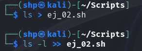
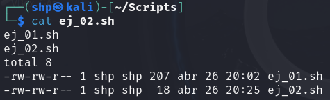

Lista los ficheros en formato normal:
- `ls`

Lista los ficheros en formato largo:
- `ls -l`
 
Guardamos la lista de archivos del directorio en el que nos encontramos (Scripts) en el archivo ej_02.sh, sobrescribiéndolo si ya existe. 

- `ls > ej_02.sh` 

Añadimos una lista detallada de archivos al final de ej_02.sh.

- `ls -l >> ej_02.sh` 

 

Al mostrar el contenido de ej_02.sh, podemos ver los resultados de los dos comandos que hemos redireccionado. 

- `cat`

