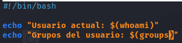
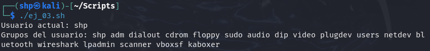

<h2>Ejercicio 3</h2>

<h4>Mostrar el usuario y los grupos del usuario que ejecuta el script.
Ejecutarlo con el usuario normal y como root.</h4>

 

Creamos el archivo **ej_03.sh** utilizando el editor de texto `nano`.
- `nano ej_03.sh` 

 

Insertamos los siguientes comandos: 

- `echo "Usuario actual: $(whoami)"`
- `echo "Grupos del usuario: $(groups)"`

Al ejecutar el archivo, se imprimirá por pantalla el usuario y los grupos del usuario. 

- `./ej_03.sh`

 
