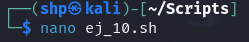
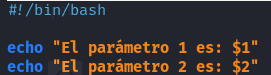
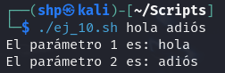

Creamos el archivo **ej_10.sh** con `nano`.
- `nano ej_10.sh`

 

Ingresamos el siguiente script:
- `#!/bin/bash` 

  `echo "El parámetro 1 es: $1"` 

  `echo "El parámetro 2 es: $2"` 

 

  Ejecutamos el archivo **ej_10.sh** y le añadimos 2 parámetros.
- `./ej_10.sh hola adios`

 
