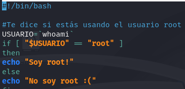
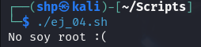

<h2>Ejercicio 4</h2>

<h4>Mostrar el mensaje “¡Soy root!” si el usuario que lo ejecuta es root, si no
mostrar el mensaje “No soy root :(“</h4>

 

Creamos el archivo **ej_01.sh** utilizando el editor de texto `nano`. 

 
- `nano ej_04.sh` 

 

Ingresamos el siguiente script:
- `#!/bin/bash` 

`if [ "$USER" == "root" ]`

`then` 

    `echo "Soy root :)"` 

`else` 

    `echo "No soy root :("` 

`fi` 

 

El script comienza con `#!/bin/bash`, que indica que se debe ejecutar con el intérprete Bash. Luego usa `if [ "$USER" == "root" ] then` para comparar si el usuario actual es root. Si la condición es verdadera, el comando `echo "Soy root :)` muestra ese mensaje. Si no, con `else` se ejecuta "`No soy root :(`", mostrando que no somos root. Finalmente, `fi` cierra la estructura del `if`.

Al ejecutar el archivo, podemos observar que en efecto, no somos el usuario root. 

- `./ej_04.sh`
 
