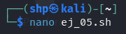
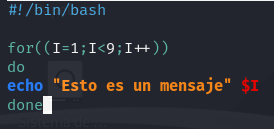
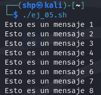

Creamos el archivo **ej_05.sh** con el editor nano:
- `nano ej_05.sh`

 
 
Dentro del archivo, creamos un bucle que repite el mensaje "Esto es un mensaje" 8 veces.

- `for ((I=1; I<9; I++))` 

`do` 

  `echo "8 veces" $I` 

`done`

 

El script comienza con `#!/bin/bash` para indicar el uso de Bash. Luego utiliza el bucle `for ((I=1; I<9; I++))` que repite 8 veces el mensaje proporcionado, incrementando la variable I de 1 a 8. Dentro del bucle, `echo "Esto es un mensaje" $I` muestra el mensaje 8 veces seguido del número de iteración en cada vuelta, y el bucle se cierra con `done`.

Al ejecutar el archivo, se ha imprimido el mensaje un total de 8 veces.
- `./ej_05.sh`

 
