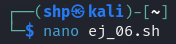
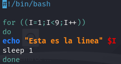

Creamos el archivo ej_06.sh con el editor `nano`.
- `nano ej_06.sh`

 

Iniciamos el script con `#!/bin/bash` para usar Bash. Luego, con el bucle `for ((I=1; I<9; I++))`, repite 8 veces, mostrando el mensaje "Esta es la linea" seguido del número de iteración usando `echo`. Después de imprimir cada mensaje, el comando `sleep 1` hace que el script pause 1 segundo antes de continuar con la siguiente repetición, y el bucle lo cerramos con `done`.

- `#!/bin/bash` 

`for ((I=1; I<9; I++))` 

`do` 

  `echo "8 veces" $I` 

  `sleep 1` 

`done` 

 

Finalmente ejectamos el archivo.
- `./ej_06.sh`
