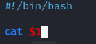
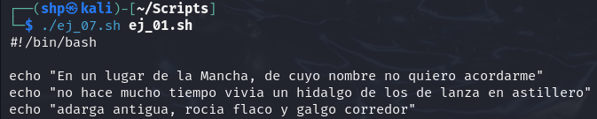

Creamos el archivo **ej_07.sh** con el editor `nano`.
- `nano ej_07.sh`

 

Ingresamos el siguiente script:
- `#!/bin/bash`

  `cat "$1"`

 

El script utiliza `#!/bin/bash` para especificar el intérprete y luego usamos `cat "$1"` para mostrar el contenido del archivo que pasaremos como primer parámetro al ejecutarlo.

Ejecutamos el archivo usando el archivo "ej_01.sh" como parámetro, lo cual hace que se ejecute el contenido del ej_01.sh.
- `./ej_07.sh ej_01.sh`

 
