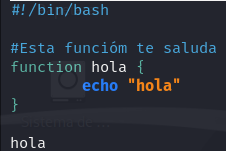
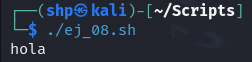

Creamos el archivo **ej_08.sh** con el editor `nano`.
- `nano ej_08.sh`

 

Creamos una función que imprima el mensaje "hola" al ejecutar el archivo.
- `#!/bin/bash` 

  `#Esta función te saluda` 

  `function hola {` 

      `echo "hola"` 

    `}` 

  `hola` 

 

  Ejecutamos el archivo:
- `./ej_08.sh`

 
