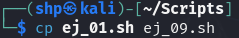
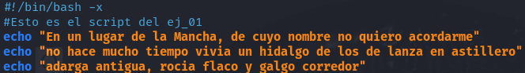
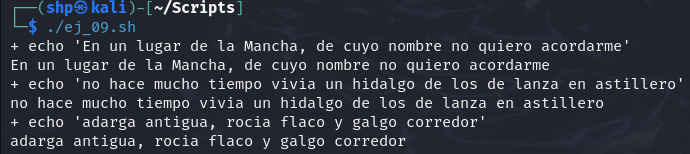

Copiamos el contenido del **ej_01.sh** dentro del archivo **ej_09.sh**.
- `cp ej_01.sh ej_09.sh`

 

Editamos el archivo **ej_09.sh** con `nano`.
- `nano ej_09.sh`

 

Añadimos el parámetro -x, que habilita el modo depuración. Esto hace que al ejecutar el archivo, se muestre cada comando y los resultados de cada comando. 

- `#!/bin/bash` 

`echo “En un lugar de la Mancha, de cuyo nombre no quiero acordarme”` 

`echo “no hace mucho tiempo que vivía un hidalgo de los de lanza en astillero”` 

`echo “adarga antigua, rocín flaco y galgo corredor”` 

 

Eejcutamos el archivo.
- `./ej_09.sh`

 
